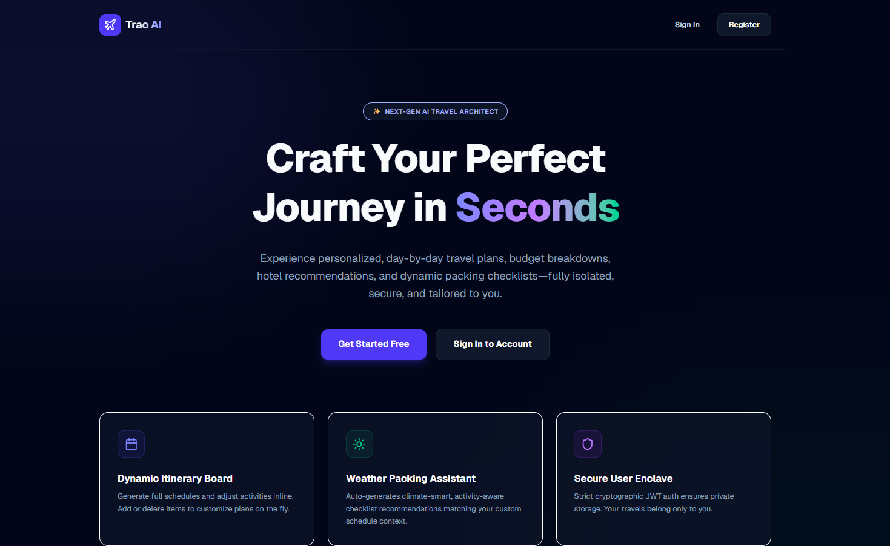
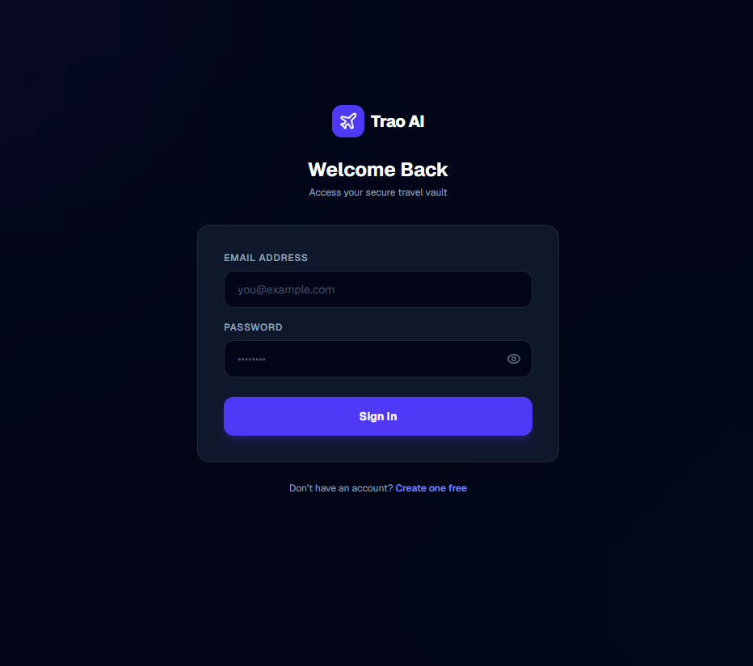
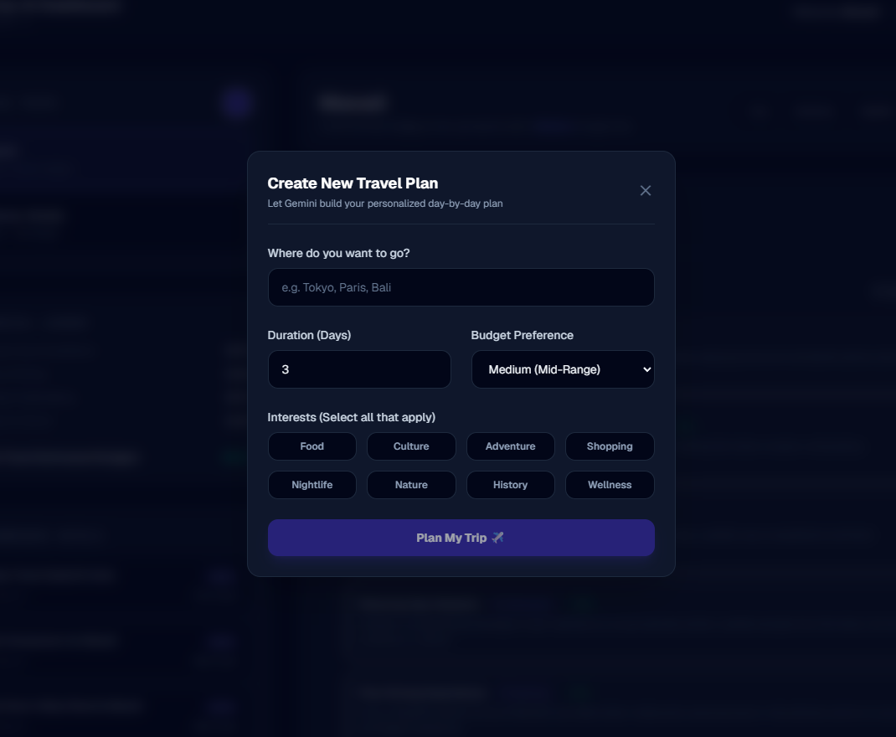
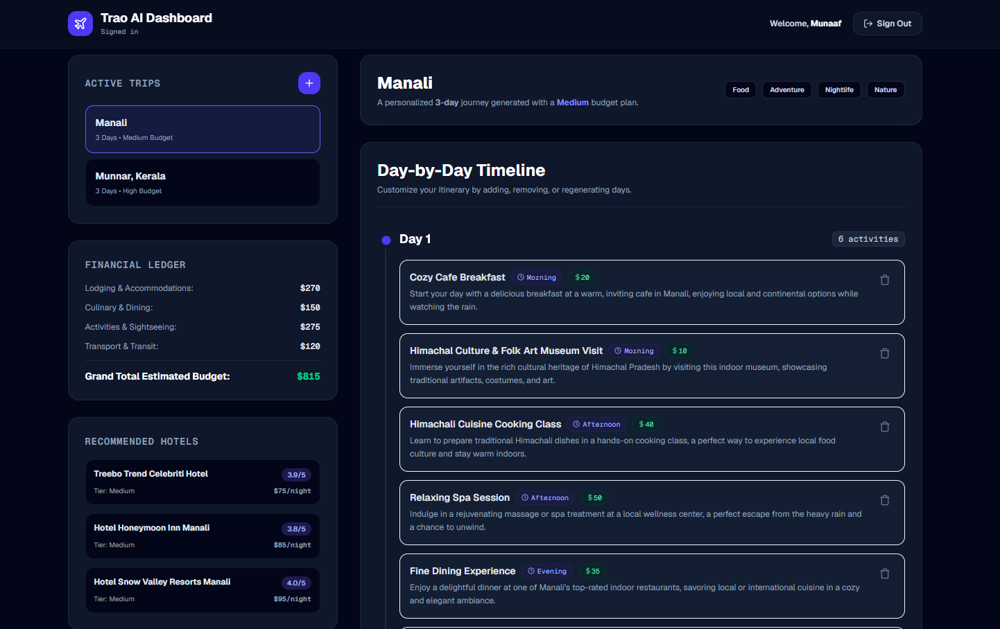
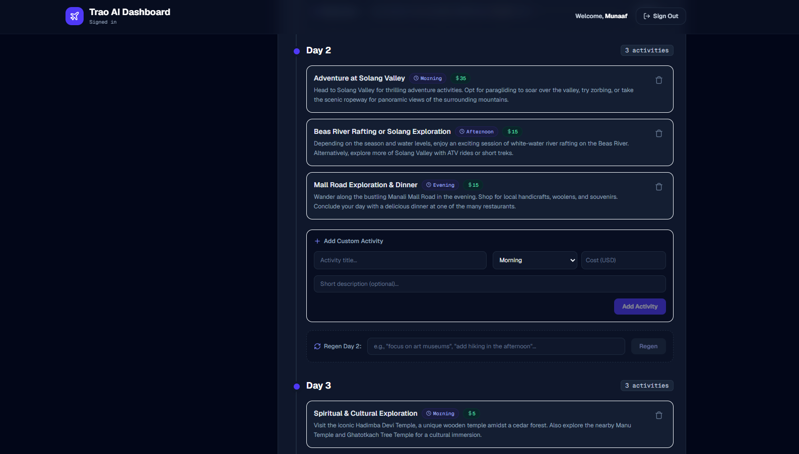
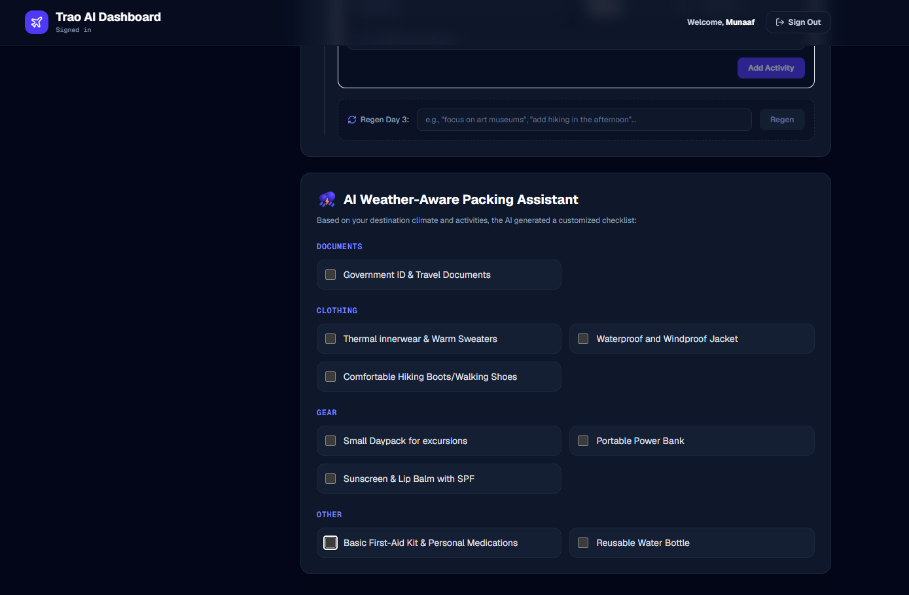

# Trao AI Travel Planner

Trao AI Travel Planner is a secure, multi-user, responsive full-stack web application that allows users to plan, customize, and manage detailed travel itineraries using Google Gemini AI. Users provide travel criteria (destination, duration, budget tier, and interests) to generate a day-by-day itinerary, estimated hotel recommendations, a financial cost ledger, and an AI weather-aware packing list checklist.

---

## 📸 Application Preview

### Landing Page


### Authentication


### AI Trip Planner


### Dashboard


### Itinerary Management


### Packing Assistant


---

## 🛠️ Chosen Tech Stack

- **Frontend:** Next.js (App Router, JavaScript) + Tailwind CSS (v4)
- **Backend:** Node.js + Express.js (JavaScript, CommonJS modules)
- **Database:** MongoDB Atlas (Mongoose ODM)
- **Authentication:** JSON Web Tokens (JWT) + password hashing with `bcryptjs`
- **AI Engine:** Google Gemini 2.5 Flash API (Structured JSON generation)

### Justification:
- **JavaScript Only:** To keep the project clean, direct, and developer-friendly without compilation layers.
- **Next.js & Tailwind CSS:** Provides a lightning-fast, production-ready, styled UI out-of-the-box.
- **Express & Mongoose:** Standard, highly reliable stack for full-stack JavaScript applications with structured data modeling.

---

## 📐 High-Level Architecture

```text
┌────────────────────────────────────────────────────────┐
│                   Next.js Client (UI)                  │
│   (Auth State, Trip Form, Dynamic Itinerary Board)    │
└───────────┬────────────────────────────────▲───────────┘
            │                                │
     REST Request                     JSON Response
 (JWT in Auth Header)           (Strict User-Isolated Data)
            │                                │
┌───────────▼────────────────────────────────┼───────────┐
│               Express.js REST API Server               │
│   ┌────────────────────────────────────────────────┐   │
│   │               Auth Middleware                  │   │
│   │   (Decodes JWT, Enforces req.user.id Checks)   │   │
│   └───────────────────────┬────────────────────────┘   │
│                           │                            │
│           ┌───────────────┴───────────────┐            │
│           ▼                               ▼            │
│   ┌───────────────┐               ┌───────────────┐    │
│   │  Trip Routes  │               │  User Routes  │    │
│   └───────┬───────┘               └───────┬───────┘    │
└───────────┼───────────────────────────────┼────────────┘
            │                               │
            ├───────────────┐               │
            ▼               ▼               ▼
┌───────────────────┐ ┌─────────┐ ┌─────────────────┐
│ Google Gemini API │ │ MongoDB │ │  MongoDB Users  │
│ (LLM Generation)  │ │  Trips  │ │  (Hashed Pass)  │
└───────────────────┘ └─────────┘ └─────────────────┘
```

---

## 🔒 Authentication & Authorization Approach

- **Token Signatures:** Upon registration/login, passwords are encrypted using `bcryptjs` (10 salt rounds). If valid, the server returns a signed JWT containing the user's document ID.
- **JWT Verification Middleware (`backend/middleware/auth.js`):** Intercepts requests to protected endpoints, parses the header `Authorization: Bearer <token>`, validates the token, and attaches the user's ID to `req.user`.
- **Database Isolation:** All database transactions query explicitly by user ID (`Trip.find({ userId: req.user.id })` / `Trip.findOne({ _id: id, userId: req.user.id })`), preventing any user from accessing or updating another traveler's data.

---

## 🧠 AI Agent Design & Prompt Engineering

The backend connects directly to the Google Gemini API (model `gemini-2.5-flash`).

- **Structured JSON Mode:** The model generation configuration has `responseMimeType: "application/json"` set. The prompt forces Gemini to respond strictly in a JSON layout fitting our database schema without any markdown backticks.
- **Resilience & Backoff:** An exponential backoff retry executor helper (`fetchWithRetry`) waits and retries calls if rate limits (HTTP 429) or transient errors occur, improving backend resilience.
- **Day Regeneration:** Users can prompt changes for a specific day. The backend requests Gemini to generate only that day's activities in JSON, updates that day's array index in MongoDB, and recalculates the estimated ledger costs.
- **Prompt Constraints:** Additional prompt constraints were used to fix enum-related output issues such as `TimeOfDay` mismatches and improve schema-safe AI responses.
- **Error Handling Focus:** AI generation and regeneration flows are designed with validation and exception handling in mind to prevent broken UI states when generation fails.

---

## ✨ Core Features

- User registration and login.
- JWT authentication and protected routes.
- Multi-user trip isolation.
- AI-generated day-by-day trip itinerary.
- Hotel recommendations.
- Financial cost ledger with category-wise budget breakdown.
- AI weather-aware packing list generation.
- Multiple trip creation and management.
- Trip selection from the dashboard.
- Add activity to itinerary.
- Remove activity from itinerary.
- Regenerate a single day of the itinerary.
- Budget recalculation after itinerary updates.
- MongoDB persistence across refresh and re-login.
- Responsive dashboard UI.

---

## ⛈️ Creative Feature: AI Weather-Aware Packing Assistant

### Why Built?
Travelers often struggle to pack relevant gear matching both the weather of the destination and the activities planned.

### What problem does it solve?
This custom feature cross-references the destination weather patterns with the itinerary context using the Gemini model. It auto-generates a checkbox packing list categorized into **Documents**, **Clothing**, **Gear**, and **Other**. Checking or unchecking items fires live PUT calls to update state in MongoDB, persisting the user's packing status.

---

## 🧭 Dashboard Modules

### 1. Active Trips Panel
Displays all trips created by the authenticated user and allows fast trip switching inside the dashboard.

### 2. Financial Ledger
Shows estimated category-wise travel costs including accommodation, food, activities, transport, and grand total.

### 3. Recommended Hotels
Displays AI-suggested hotels with rating, budget tier, and estimated nightly cost.

### 4. Itinerary Manager
Renders day-by-day activities and supports adding activities, removing activities, and regenerating a specific day.

### 5. Packing Assistant
Displays a checklist-based packing list and persists packed/unpacked status in MongoDB.

---

## ⚙️ Setup & Installation Instructions

### Prerequisites
- Node.js LTS (v18.x or v20.x/v22.x)
- MongoDB running locally or a MongoDB Atlas cloud cluster URI
- Google AI Studio Gemini API Key

### 1. Backend Local Setup
1. Open a terminal in the `backend/` folder.
2. Create a `.env` file from the example:
   ```bash
   cp .env.example .env
   ```
3. Set your environment keys inside `.env`:
   - `PORT=5000`
   - `MONGO_URI=mongodb+srv://...` (or a local instance `mongodb://localhost:27017/trao-travel`)
   - `JWT_SECRET=any_random_string`
   - `GEMINI_API_KEY=your_gemini_api_key_here`
4. Install dependencies:
   ```bash
   npm install
   ```
5. Start backend server:
   ```bash
   node server.js
   ```

### 2. Frontend Local Setup
1. Open a terminal in the `frontend/` folder.
2. Install dependencies:
   ```bash
   npm install
   ```
3. Create/update `frontend/.env.local` to match your local backend URI:
   ```env
   NEXT_PUBLIC_API_URL=http://localhost:5000/api
   ```
4. Launch development server:
   ```bash
   npm run dev
   ```
5. Open your browser at [http://localhost:3000](http://localhost:3000).

---

## 📁 Suggested Project Structure

```text
trao-travel/
├── backend/
│   ├── controllers/
│   ├── middleware/
│   ├── models/
│   ├── routes/
│   ├── utils/
│   ├── server.js
│   └── .env
├── frontend/
│   ├── app/
│   ├── components/
│   ├── utils/
│   ├── public/
│   └── .env.local
└── README.md
```

---

## 🧪 Testing & Verification Checklist

Use the following checklist before final submission or deployment:

1. Create a new user account.
2. Log in with valid credentials.
3. Create 2–3 trips.
4. Refresh the page and verify trips persist.
5. Log out and log in again.
6. Confirm only that user's trips are visible.
7. Select an existing trip from the dashboard.
8. Add a new activity.
9. Remove an activity.
10. Regenerate one specific day.
11. Delete one trip.
12. Check MongoDB Atlas to ensure all changes are reflected.
13. Confirm there are no red errors in the browser console.
14. Confirm there are no backend terminal/runtime errors.

---

## 🚀 Deployment Steps

### Backend Deployment (Render or Railway)
1. Push the `backend/` folder to GitHub.
2. Create a new Web Service in Render or a new project in Railway.
3. Set the root directory to `backend/`.
4. Add the required environment variables:
   - `PORT`
   - `MONGO_URI`
   - `JWT_SECRET`
   - `GEMINI_API_KEY`
   
5. Set the start command:
   ```bash
   node server.js
   ```
6. Deploy and test all API routes.

### Frontend Deployment (Vercel)
1. Push the `frontend/` folder to GitHub.
2. Import the project into Vercel.
3. Set the root directory to `frontend/`.
4. Add the environment variable:
   ```env
   NEXT_PUBLIC_API_URL=https://your-backend-domain/api
   ```
5. Deploy the app.
6. Test login, dashboard loading, protected routes, trip creation, trip updates, regeneration, and deletion.

### Production Validation
After deployment:
- Register a new production user.
- Create multiple trips.
- Refresh and verify persistence.
- Log out and log back in.
- Add and remove activities.
- Regenerate a day.
- Delete a trip.
- Confirm MongoDB Atlas updates correctly.
- Confirm there are no production console or backend runtime errors.

---

## 🔮 Future Enhancements

- Dynamic currency conversion from USD to any searchable currency using a live exchange-rate API.
- Export itinerary as PDF.
- Email sharing of travel plans.
- Map integration for routes and attractions.
- Saved favorite destinations and reusable trip templates.
- Weather forecast API integration for more precise packing recommendations.

---

## ⚠️ Known Limitations

1. **Local Storage Auth Sync:** Token storage is managed in client-side `localStorage`. It does not use HTTP-only cookies which are technically more secure against XSS.
2. **AI JSON Parsing:** If the Gemini model returns misformatted JSON due to unusual character inputs, JSON parsing could fail, though this is reduced using strict prompt constraints and validation handling.
3. **External API Dependency:** Trip generation quality and response speed depend on Gemini API availability and rate limits.
4. **Deployment Configuration Sensitivity:** Incorrect environment variable setup or CORS configuration can break production API communication.

---

## ✅ Project Status

The application currently supports secure authentication, protected routes, MongoDB persistence, Gemini-powered itinerary generation, hotel recommendations, budget estimation, weather-aware packing lists, multiple trip handling, activity add/remove operations, day regeneration, and dashboard-based trip management in a working full-stack flow.